User manual
===========

Roles
-----

The TkDQMDoctor distinguishes between 3 different Roles

-  Shifter
-  Shift Leader
-  Admins

Each role has their set of rights which are explained in the following
chapters.

Login
-----

The first thing a user has to do in order to be able to modify data is
to login. The recommended way of logging is using CERN Single
sign-on by clicking on the "Login with CERN" button.

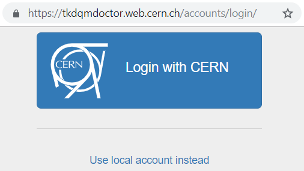

If the user wants to log in with a local account that is only used by
the TkDQMDoctor website instead, he can do so by entering the
credentials and clicking on "Sign in".

Logging in with CERN updates the user privileges automatically, such
that shift leaders are detected by the e-groups the user is a member of.
The Shift Leader e-group is automatically assigned and does not have to
be updated manually.

Shifter
-------

Add a Certification
~~~~~~~~~~~~~~~~~~~

Adding a new run certification can be done by clicking the "Add Run" button in the navigation bar at the top of the
page.

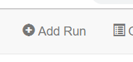

This will open a new form in which the certified run can be filled with.

The form consists of the following elements:

-  **Type**: What kind of run is it?
-  **Reference Run** Which Reference Run was used to certify this run?
-  **Run number**
-  **Trackermap**: Does the Trackermap exist or is it missing?
-  **Number of luminosity sections**
-  **Integrated luminosity**
-  **Pixel**: Status of the Pixel Component (good/ bad/ excluded/ low
   statistics)
-  **SiStrip**: Status of the SiStrip Component
-  **Tracking**: Status of the Tracking?
-  **Problem categories**: A list checkboxes with problems that appeared
   in this run
-  **Comment**: Extra comments that are worth to mention
-  **Date**: The date of the certification

The first thing a shifter might want to do is specify what kind of run
it is. A run can be either "Collisions" or "Cosmics" as run type and
either "Prompt", "Express" or "reReco" as reconstruction type. By
clicking the corresponding checkboxes, the list of possible type and
references runs will be updated to only show the necessary ones with the
most recent first.

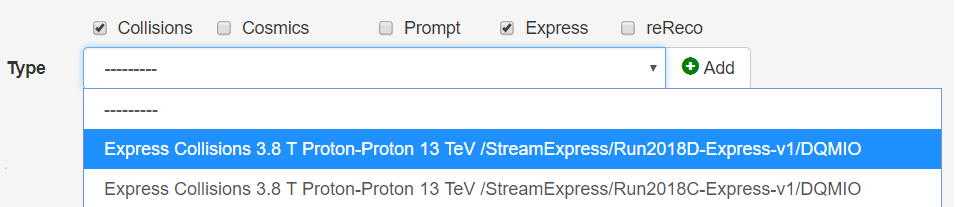

If the shifter does not want the list of references runs to be matching
with the run type, then he can uncheck the "Match Type" checkbox. Then
the shifter can then proceed with filling the rest of the form.

Checklists
^^^^^^^^^^

Some fields have required "Checklists" which have to be checked to be
able to submit a new run certification. The checklists consist of
instructions which have to be performed in order to certify the
data correctly. It also includes links with easy access to external
tools that should be used during the data certification process.

A certified run cannot be submitted unless every checkbox is read and
checked. This ensures that no shortcuts are taken and to improve the
quality of certifications.

Add a Type
^^^^^^^^^^

If the desired Type does not exist in the dropdown list of types, then a
new type can be added by click on the "Add" button next to the dropdown
list. The shifter can then enter the details of the new type in the
redirected page.

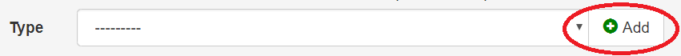

Automatic Form validation
^^^^^^^^^^^^^^^^^^^^^^^^^

A number of form validations are implemented in order to help the
shifter to submit correct data. For example, if the *SiStrip* component
was certified as "Bad", then it is impossible to certify Tracking as
"Good".

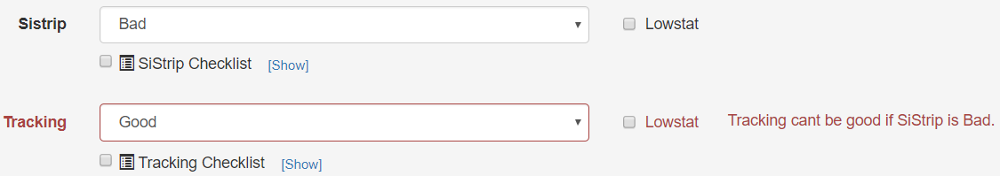

The form also checks for inconsistency between other certified runs. If
for example a run with the run number 322487 was certified "Good" in
Stream Express but "Bad" in Prompt then the form warns the shifter that
the data is inconsistent and should be checked. If a form has warnings
the run can still be submitted but does require extra caution and
explicit confirmation.

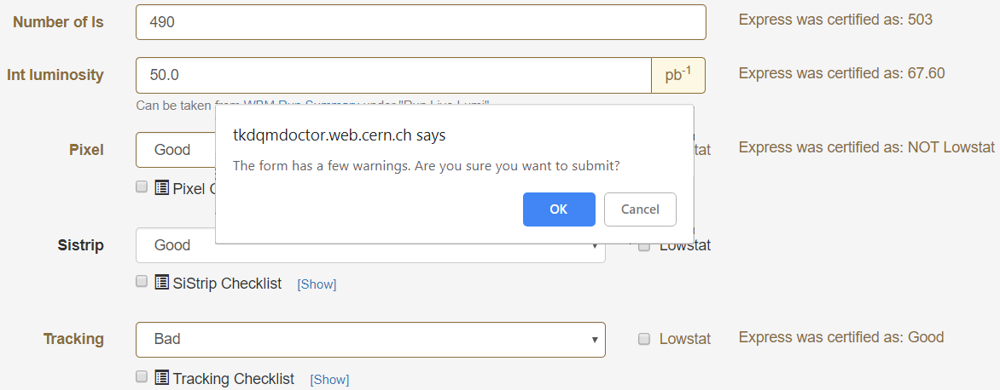

Once a run is created with the "Create" button at the bottom of the
form, the run will appear in the list of Certified runs. If the shifter
wants to edit a certified run, he can do so by clicking on the "Edit"
button in the list of certified runs.

Shift Leader
------------

Once a shift leader logs in via CERN SSO, the website automatically
detects the shift leader status by the e-groups the user is associated
with. In particular, the current shift leader should always be
automatically assigned to the e-group "cms-tracker-offline-shiftleader".

The user can ensure he has shift leader rights by checking if a "Shift
Leader" or an "Admin Settings" tab appears in the navigation bar.

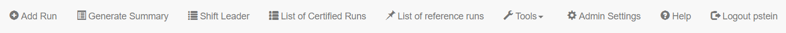

Admin Settings
~~~~~~~~~~~~~~

The admin settings are a special site which can only be accessed by
users with the necessary privileges.

Add Reference Run
^^^^^^^^^^^^^^^^^

A new reference run can be added in the Admin Settings by clicking on "+
Add" next to Reference runs.

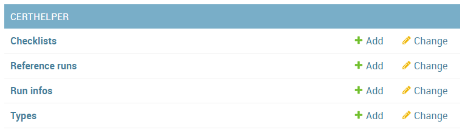

Add (problem) categories
^^^^^^^^^^^^^^^^^^^^^^^^

A new problem category can be added in the
Admin Settings by clicking on "+ Add" next to Categories.

Update Checklists
^^^^^^^^^^^^^^^^^

There are five checklists which are displayed in the "Add Run" form.
Each checklist has a unique "identifier" naming *pixel*, *sistrip*,
*tracking*, *general* and *trackermap*. The identifiers are important to
associate a form field with the corresponding checklist. The content of
a checklist can be updated in the admin panel by clicking on the
corresponding title.

Shift Leader View
~~~~~~~~~~~~~~~~~

In the shift leader view, a shift leader receives information about all
the certified run for the current week. The page consists of multiple
tools, which facilitate the shift leader in creating weekly shift leader
reports.

Filter
~~~~~~

At the top of the page, the shift leader can filter the certified runs
by his needs. If no filters were specified, then the current week is
automatically selected.

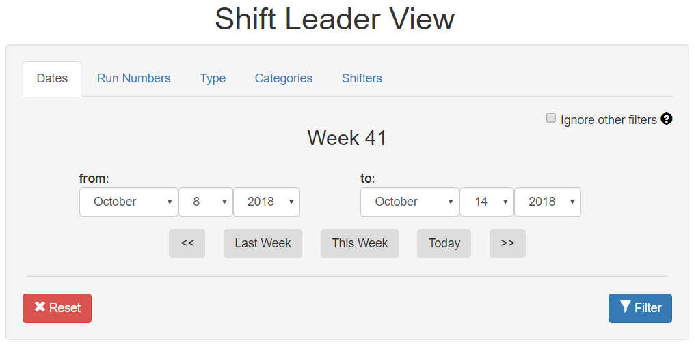

The runs can be filtered by time, run number, run type, problem
categories or specific shifters. When clicking the "Filter" button, the
whole shift leader page gets updated according to the specified
criteria.

Certified Runs tab
~~~~~~~~~~~~~~~~~~

In the "Certified Runs" tab a tabular list of all the certified runs for
the current week (or specified filter criteria) is shown. The shift
leader has the right to edit the certifications of the shifters or
delete them entirely. It is essential to keep the list of certified runs
correct in order to generate accurate shift leader reports.

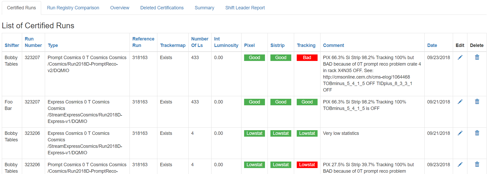

Run Registry Comparison tab
~~~~~~~~~~~~~~~~~~~~~~~~~~~

In the "Run Registry Comparison" tab, the shifter can verify that the
runs in the Certification helper match with the entries in the Run
Registry. If any runs differ, they will be listed in this tab. A shift
leader can then edit the runs himself or tell the shifter to update them
accordingly.

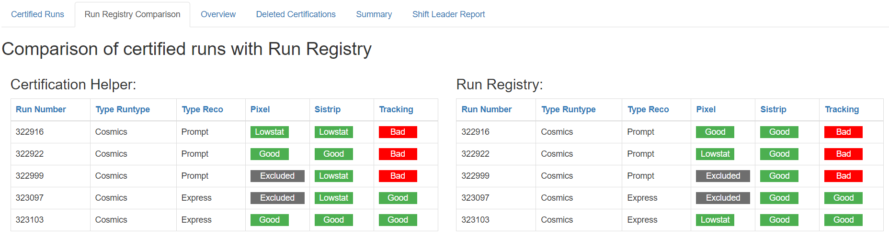

Overview tab
~~~~~~~~~~~~

In the "Overview" tab a quick overview of the certified runs can be
seen. It also consists of the list of shifters for that week.

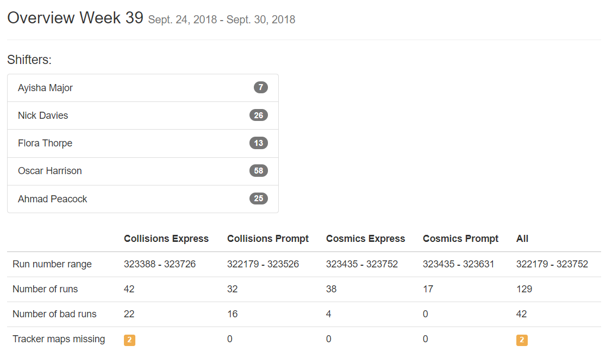

Delete Certifications
~~~~~~~~~~~~~~~~~~~~~

If a run gets deleted by shift leader it can still be restored in the
"Deleted Certifications" tab. If the shift leader wishes he can also
irrevocably delete the certification of the run there.

Summary tab
~~~~~~~~~~~

In the "Summary" tab the shift leader can generate the same kind of
summary report that the shifters submit to the ELOG. It is just a
textual version of all the certifications.

Shift Leader Report tab
~~~~~~~~~~~~~~~~~~~~~~~

The most useful tab for shift leaders is the "Shift leader Report" tab.
It automatically generates slides for the weekly shift leader report.

List of LHC Fills
^^^^^^^^^^^^^^^^^

This page lists all the LHC fills that were part in a certification that
week. The LHC fill number is taken from the Run Registry via the resthub
API.

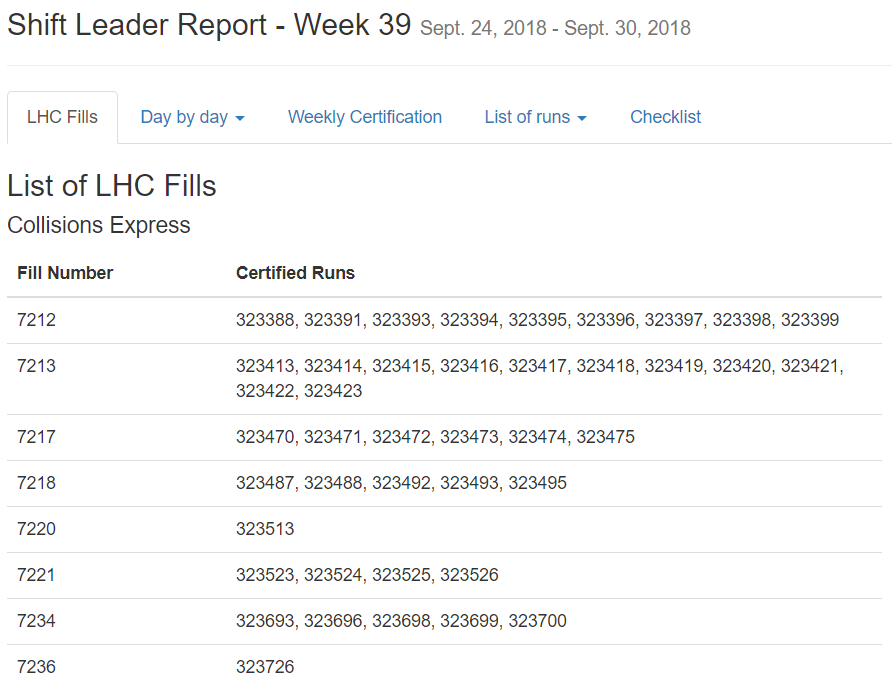

Weekly Certification
^^^^^^^^^^^^^^^^^^^^

This tab generates the slide called "Weekly certification". It sums up
the number of certified runs for each type and the corresponding
integrated luminosity.

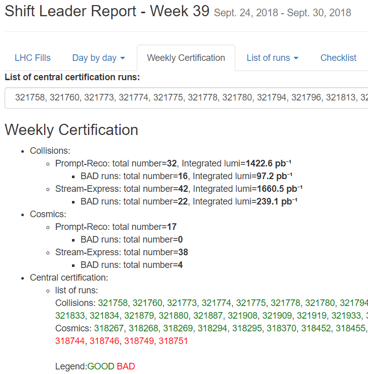

Day by Day
^^^^^^^^^^

The "Day by day" notes give a quick overview for each day of the week.

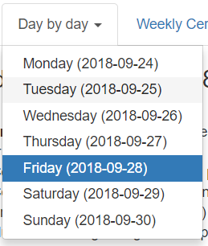

List of runs
^^^^^^^^^^^^

This page list all the run numbers of runs certified that were certified
that week, grouped by reconstruction type and day. The run numbers are
colored green if the run was certified "Good" and red for "Bad".

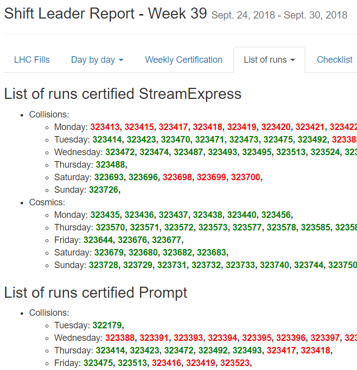

Administrator
-------------

The administrator has the most power in the website. He can create new
(local) users and is responsible for maintaining the website. He can
update or create the OAuth2 keys, which are necessary for CERN Single
sign-on.

The admin panel of the administrator consists of all of the same rights
that a shift leader has plus additional settings that for site
management.
